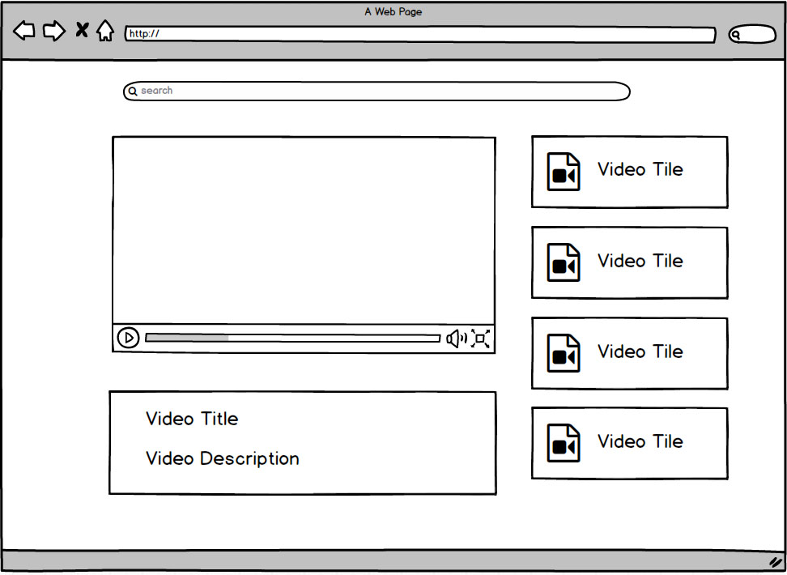
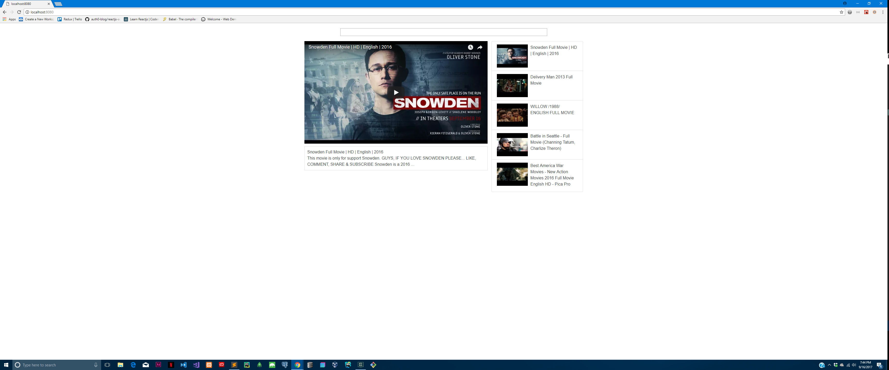

# ReactMedia

#Project One YouTube Clone with React

## Mockup of finished project


## Actual Image from my browser


## Getting project on your own machine
If you are only looking to get this project on your machine out of this repository then you will want to do the following

```
> git clone https://github.com/Brian-Dennis/YoutubeClone.git
> cd YouTubeClone
> npm install
> npm start
```

## Viewing the project locally in your browser after running npm start

this project is set to run on port `3000` of your local machine if you wish to view it inside your favorite browser just type `localhost:3000` inside of your url address bar. Then the project should be viewable via your choice of browser.
